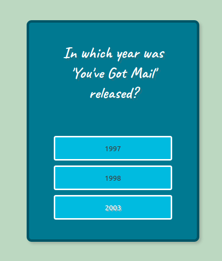
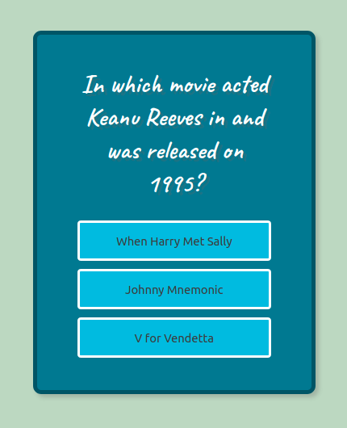

# QuizDB

_A personal dynamic flash cards_

QuizDb is a really small flashcards games based in a graphical database that you setup.
The goal of this game is to improve the capabilities and the playability of 
flashcards (anki cards) adding more dynamism to the questions you get instead of a rigid set of them.

As a side project, the goal was to play with different technologies like neo4j databases or docker-compose.

As MVP, the neo4j dataset used in this project is a demo one, related with Hollywood movies and actors,
that comes by default with the the neo4j installation.

# Screenshots





# Setup

```docker-compose up```

Go to http://localhost:7474/browser/browser/ and run:

```play :movies```

# Play

Go to http://localhost:3000 and start aswering questions!

# Goals

Right now, there are only two types of questions about movies in this mvp but 
the long term goal is to bundle (datasets + dynamic questions) and share it 
with other people. They can beed datasets about whatever topic. It
can be books, authors, movies, etc. 

## Documentation

- https://neo4jrb.readthedocs.io/en/stable/
